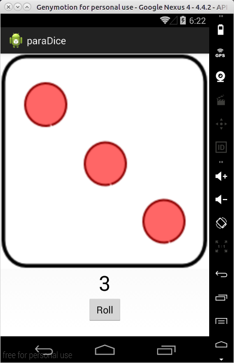

Android Change Image Sample
-------------------------

##Overview



(executed from genymotion emulator)

Press "Roll" Button to generate random number and change to responding dice image.


##Code Review

```java
Bitmap dices[] = new Bitmap[6];
```

use Bitmap array to handle all dice images

```java
diceImage.post(new Runnable() {
	
	@Override
	public void run() {
		// TODO Auto-generated method stub
		diceImage.setImageBitmap(dices[diceNum-1]);
	}
});

```
post Runnable to update UI thread


[full java code](https://github.com/yukaihuang1993/dice/blob/master/src/com/example/paraDice/RollDice.java)